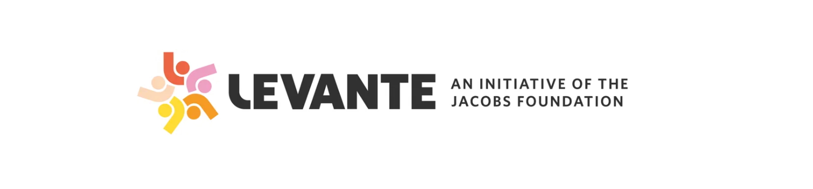

---
# Feel free to add content and custom Front Matter to this file.
# To modify the layout, see https://jekyllrb.com/docs/themes/#overriding-theme-defaults

permalink: /
title: Home
layout: home
---

Join us for the **LEVANTE Hackathon 2026**, a two-week virtual event designed to help researchers learn and use LEVANTE data on children’s learning across the globe. Through talks, tutorials, and hands-on projects, participants will learn approaches for using LEVANTE’s global data in open, responsible, and rigorous ways.

# What is LEVANTE? 
The Learning Variability Network Exchange (LEVANTE) is a research framework and platform for coordinated data collection on children’s learning by research teams worldwide.

# 📅 Program Overview

**Week 1**: July 6-10  
Join us for talks, tutorials, and panel discussions, open to all!  

**Week 2**: July 13-17  
Selected hackathon participants will pitch, create, and present LEVANTE-related projects. *Note: Hackathon participants are expected to attend the full two-week program.*

# 🌍 Logistics
All sessions are virtual, running between 8:00-10:30 am Pacific Time.

Local, in-person hubs will be hosted at:
- Stanford, California, USA
- Buenos Aires, Argentina
- Sheffield, UK

# 🔗 Stay Connected
- Save the date on your calendar
- Apply for the hackathon week! Applications open in February 2026
- Bookmark this page for updates, including when applications open
- Reach out to levantehackathon@gmail.com with questions, or if you’d like to host a local hub
